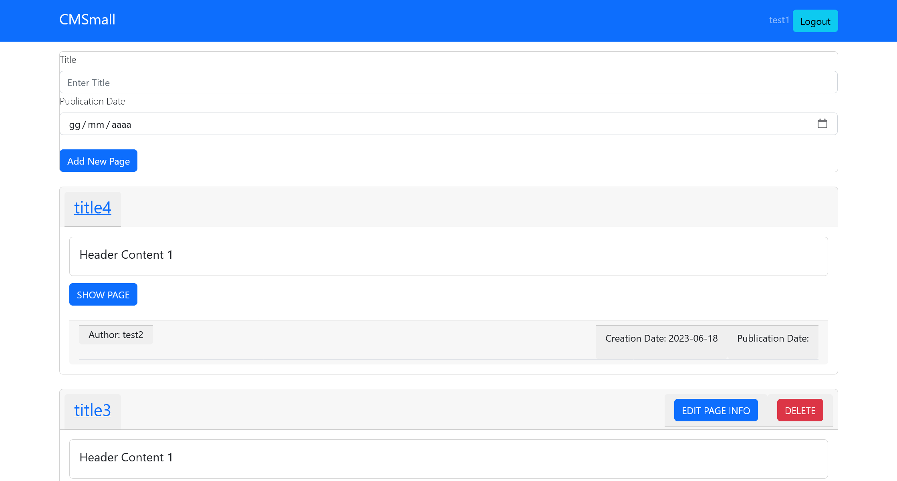
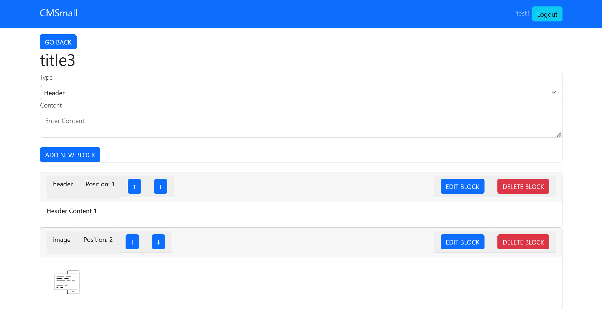

# Exam #1: "CMSmall"

## Student: s310166 GALELLA ANDREA 

# Server side

## API Server

- POST `/api/login`
  - description: login for users
    - request parameters: none
    - request body content: email, password
    - response: `200 OK` (success)
- POST `/api/logout`
  - description: logout for registered users 
    - request parameters: none
    - request body content: none
    - response: `200 OK` (success)
- GET `/api/users`
  - description: get all users id and usernames
    - request parameters: none
    - request body content: none
    - response: `200 OK` (success)
    - response body content: array of objects containing all users id and usernames
    - error responses: `500 Internal Server Error` (generic error)
- GET `/api/users/:idUser`
  - description: get user's username by id
    - request parameters: user id
    - request body content: none
    - response: `200 OK` (success)
    - response body content: object containing user's username
    - error responses: `500 Internal Server Error` (generic error)
- GET `/api/name`
  - description: get website name
    - request parameters: none
    - request body content: none
    - response: `200 OK` (success)
    - response body content: object containing the website title
    - error responses: `500 Internal Server Error` (generic error)
- PUT `/api/name`
  - description: update website name
    - request parameters: none
    - request body content: title
    - response: `200 OK` (success)
    - error responses: `500 Internal Server Error` (generic error),
      `401 Unauthorized User` (user is not logged in)
- GET `/api/pages/all`
  - description: get all the pages 
    - request parameters: none
    - request body content: none
    - response: `200 OK` (success)
    - response body content: array of objects containing all pages properties
    - error responses: `500 Internal Server Error` (generic error),
      `401 Unauthorized User` (user is not logged in)
- GET `/api/pages`
  - description: get only the published pages
    - request parameters: none
    - request body content: none
    - response: `200 OK` (success)
    - response body content: array of objects containing published pages properties
    - error responses: `500 Internal Server Error` (generic error)
- POST `/api/pages`
  - description: add a new page 
    - request parameters: none
    - request body content: title, idUser, creationDate, publicationDate, blocks
    - response: `200 OK` (success)
    - error responses: `500 Internal Server Error` (generic error),
      `401 Unauthorized User` (user is not logged in)
- PUT `/api/pages/:idPage`
  - description: update a page 
    - request parameters: idPage
    - request body content: idPage, title, idUser, creationDate, publicationDate
    - response: `200 OK` (success)
    - error responses: `500 Internal Server Error` (generic error),
      `401 Unauthorized User` (user is not logged in)
- DELETE `/api/pages/:idPage`
  - description: delete a page
    - request parameters: idPage
    - request body content: none
    - response: `200 OK` (success)
    - error responses: `500 Internal Server Error` (generic error),
      `401 Unauthorized User` (user is not logged in)
- GET `/api/pages/:idPage`
  - description: get page's blocks 
    - request parameters: idPage
    - request body content: none
    - response: `200 OK` (success)
    - response body content: array of objects containing page's blocks (for all pages)
    - error responses: `500 Internal Server Error` (generic error),
      `401 Unauthorized User` (user is not logged in)
- GET `/api/pages/pub/:idPage`
  - description: get page's blocks (only for published pages)
    - request parameters: idPage
    - request body content: none
    - response: `200 OK` (success)
    - response body content: array of objects containing page's blocks (for only published pages)
    - error responses: `500 Internal Server Error` (generic error)
- POST `/api/pages/:idPage`
  - description: add a new block to a page
    - request parameters: idPage
    - request body content: idPage, type, content, position
    - response: `200 OK` (success)
    - error responses: `500 Internal Server Error` (generic error),
      `401 Unauthorized User` (user is not logged in)
- PUT `/api/pages/:idPage/blocks/:idBlock`
  - description: edit a block 
    - request parameters: idPage, idBlock
    - request body content: idPage, idBlock, type, content, position
    - response: `200 OK` (success)
    - error responses: `500 Internal Server Error` (generic error),
      `401 Unauthorized User` (user is not logged in)
- DELETE `/api/pages/:idPage/blocks/:idBlock`
  - description: delete a block 
    - request parameters: idPage, idBlock
    - request body content: position
    - response: `200 OK` (success)
    - error responses: `500 Internal Server Error` (generic error),
      `401 Unauthorized User` (user is not logged in)

## Database Tables

- Table `website` - contains the website title
  (id, title)
- Table `users` - contains the registered users 
  (id, username, email, role, password, salt)
- Table `pages` - contains the website pages
  (id, title, idUser, creationDate, publicationDate)
- Table `blocks` - contains the website blocks
  (id, idPage, type, content, position)

# Client side

## React Client Application Routes

- Route `/`: shows the list of all the pages for registered users and
the list of published pages for anonymous ones
- Route `/login`: used for login
- Route `/pages/:idPage`: shows all the page blocks
- Route `/pages/add`: used to add blocks for a new page

## Main React Components

- `PagesList` (in `PagesList.jsx`): retrieves the pages and shows them, 
handles the insertion of properties for a new page, editing a page properties,
deleting a page.
- `BlockList` (in `BlockList.jsx`): retrieves page blocks and shows them,
handles adding new blocks, editing blocks, deleting a block.
- `AddPage` (in `AddPage.jsx`): handles the adding of blocks for a new page.
- `LoginForm` (in `Login.jsx`): contains the login form

(only _main_ components, minor ones may be skipped)

# Usage info

## Example Screenshot
### Creating a new page
#### The insertion of the page properties can be done from the homepage

#### Pressing on Add New Page will redirect to adding the blocks for the new page

### List of all pages
#### Front-Office pages

#### Front-Office page blocks

#### Back-Office pages

#### Back-Office page blocks

## Users Credentials

- email: test1@test.com, password: password
  - username: test1, role: regular
- email: test2@test.com, password: password
  - username: test2, role: admin
- email: test3@test.com, password: password
  - username: test3, role: regular
- email: test4@test.com, password: password
  - username: test4, role: admin
